# WhatsApp Auto-Reply Bot with Google Sheets Integration

<div align="center">


**A powerful WhatsApp auto-reply bot with Google Sheets integration, built with Next.js 16**

[Features](#features) • [Screenshots](#screenshots) • [Installation](#installation) • [Documentation](#documentation)

</div>

---

## Overview

This application provides a complete solution for automating WhatsApp responses and syncing data with Google Sheets. It features a modern, responsive dashboard with multi-language support (Arabic RTL & English).

## Features

### Core Features
- **Smart Auto-Reply Rules** - Create rules with exact match, contains, starts with, or regex patterns
- **WhatsApp Web Integration** - Connect via QR code scanning using Baileys
- **Google Sheets Sync** - Automatically sync contacts and messages to Google Sheets
- **Multi-language Support** - Arabic (default with RTL) and English

### Dashboard Features
- **Real-time Statistics** - Monitor messages, contacts, and rule performance
- **Contact Management** - View, search, and manage WhatsApp contacts
- **Message History** - Complete log of all incoming and outgoing messages
- **Rule Management** - Create, edit, toggle, and delete auto-reply rules
- **Dark Mode** - Full dark theme support

---

## Screenshots

### Login Page
<div align="center">
<table>
<tr>
<td align="center"><strong>Arabic (RTL)</strong></td>
<td align="center"><strong>English</strong></td>
</tr>
<tr>
<td>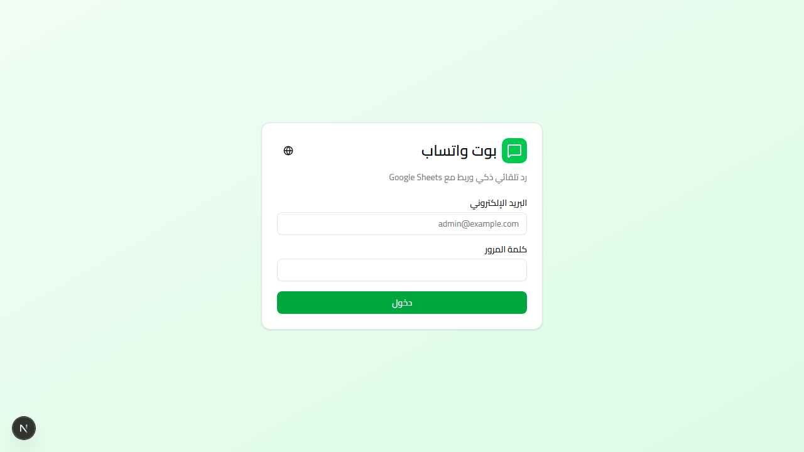</td>
<td>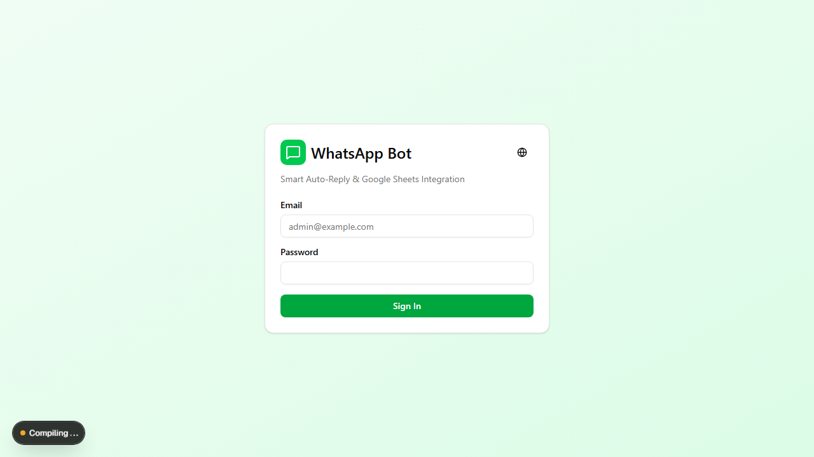</td>
</tr>
</table>
</div>

### Dashboard
<div align="center">
<table>
<tr>
<td align="center"><strong>Main Dashboard</strong></td>
<td align="center"><strong>Dark Mode</strong></td>
</tr>
<tr>
<td>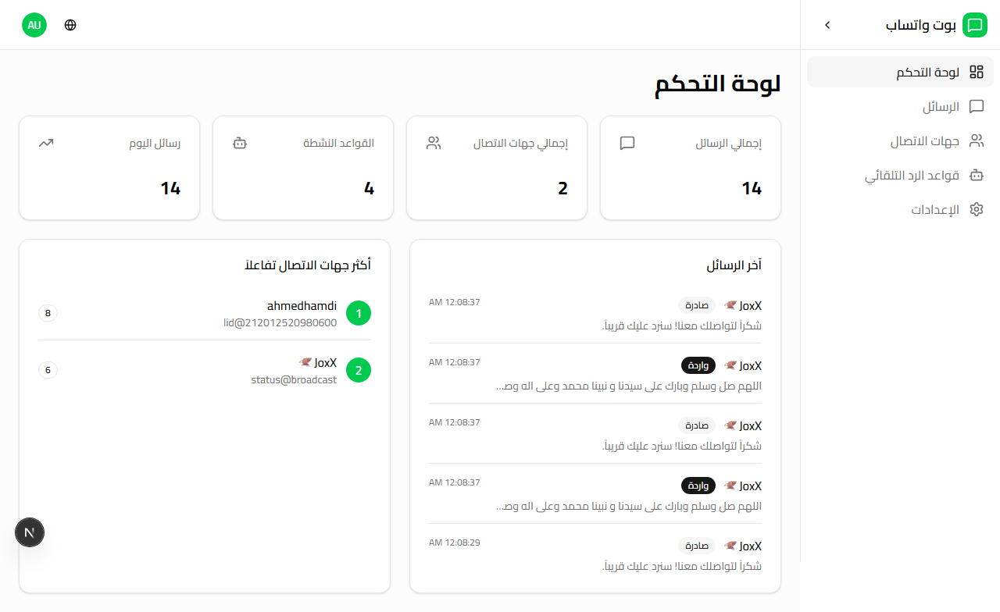</td>
<td>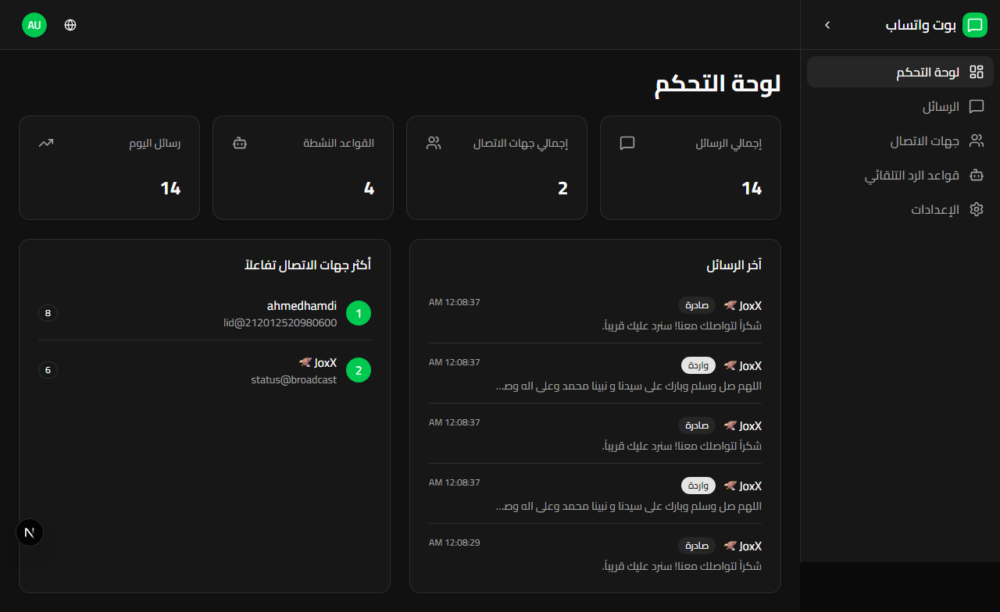</td>
</tr>
</table>
</div>

### Auto-Reply Rules
<div align="center">
<table>
<tr>
<td align="center"><strong>Rules List</strong></td>
<td align="center"><strong>Create Rule</strong></td>
</tr>
<tr>
<td>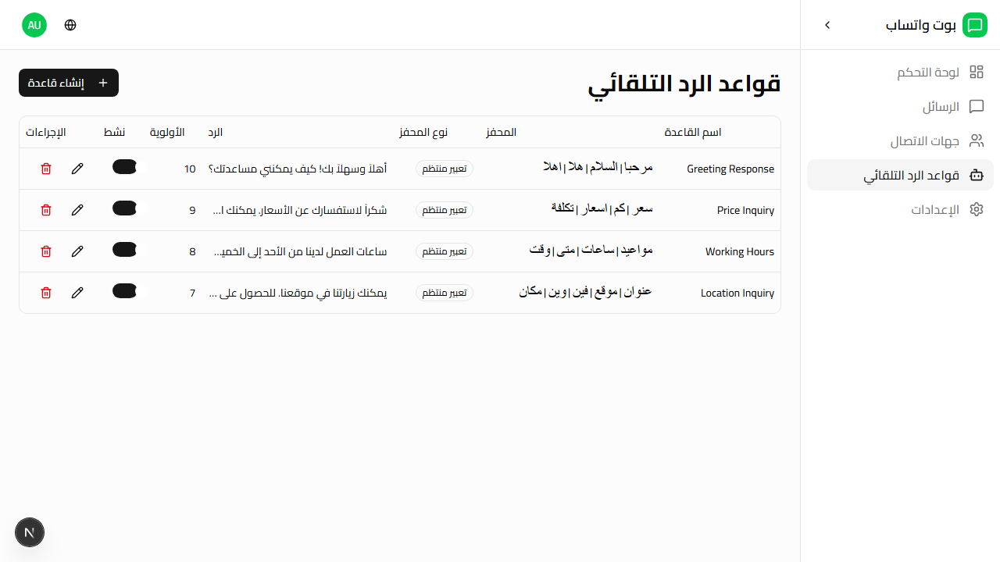</td>
<td>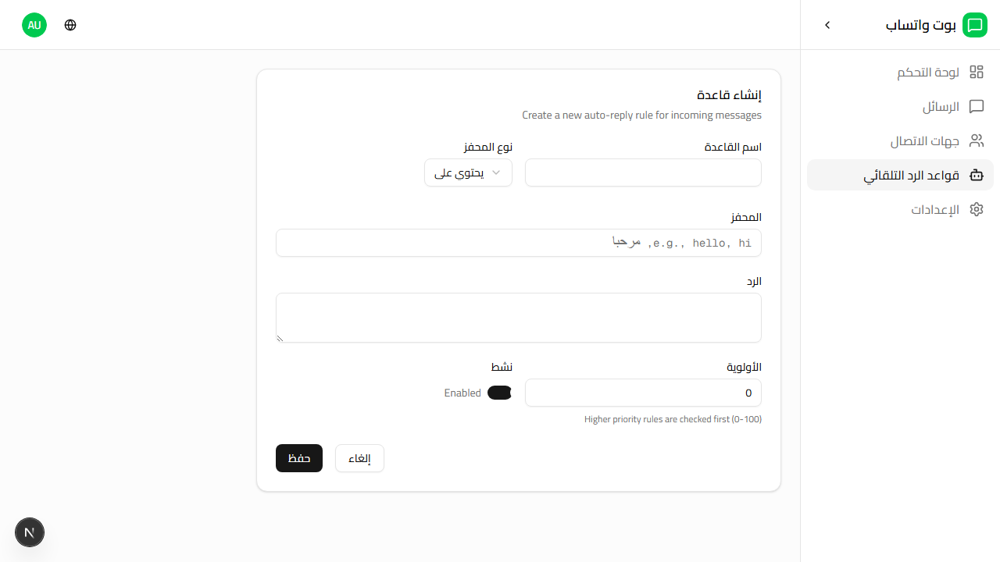</td>
</tr>
</table>
</div>

### Messages & Contacts
<div align="center">
<table>
<tr>
<td align="center"><strong>Messages</strong></td>
<td align="center"><strong>Contacts</strong></td>
</tr>
<tr>
<td>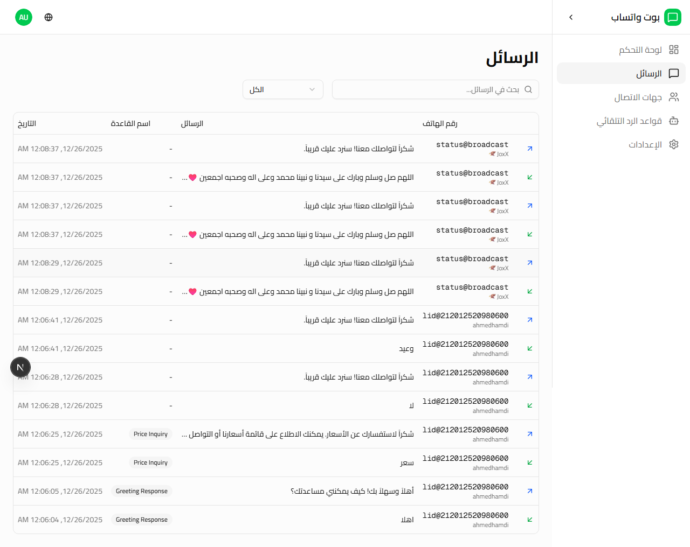</td>
<td>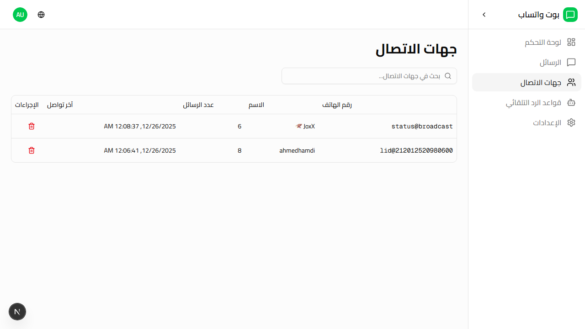</td>
</tr>
</table>
</div>

### Settings
<div align="center">
<table>
<tr>
<td align="center"><strong>General Settings</strong></td>
<td align="center"><strong>WhatsApp Connection</strong></td>
</tr>
<tr>
<td>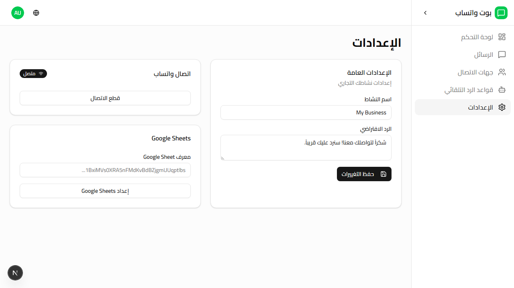</td>
<td>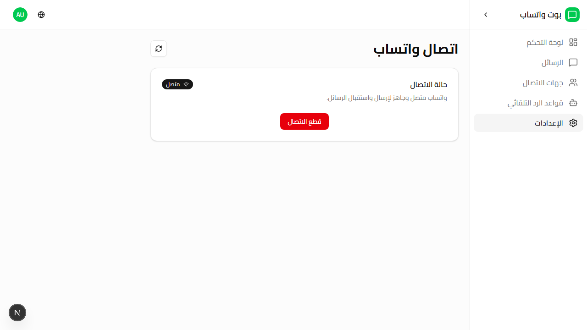</td>
</tr>
</table>
</div>

### Mobile Responsive
<div align="center">
<table>
<tr>
<td align="center"><strong>Dashboard Mobile</strong></td>
<td align="center"><strong>Rules Mobile</strong></td>
</tr>
<tr>
<td>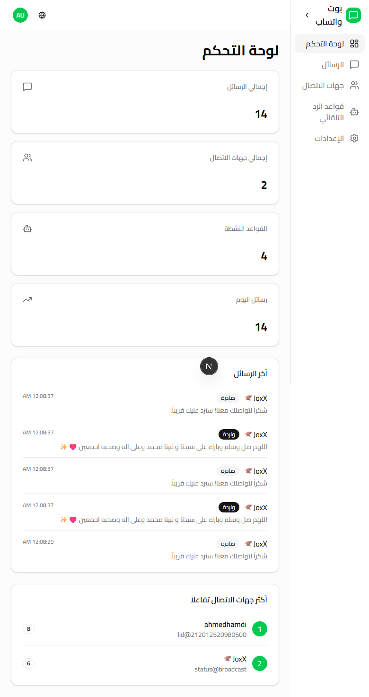</td>
<td>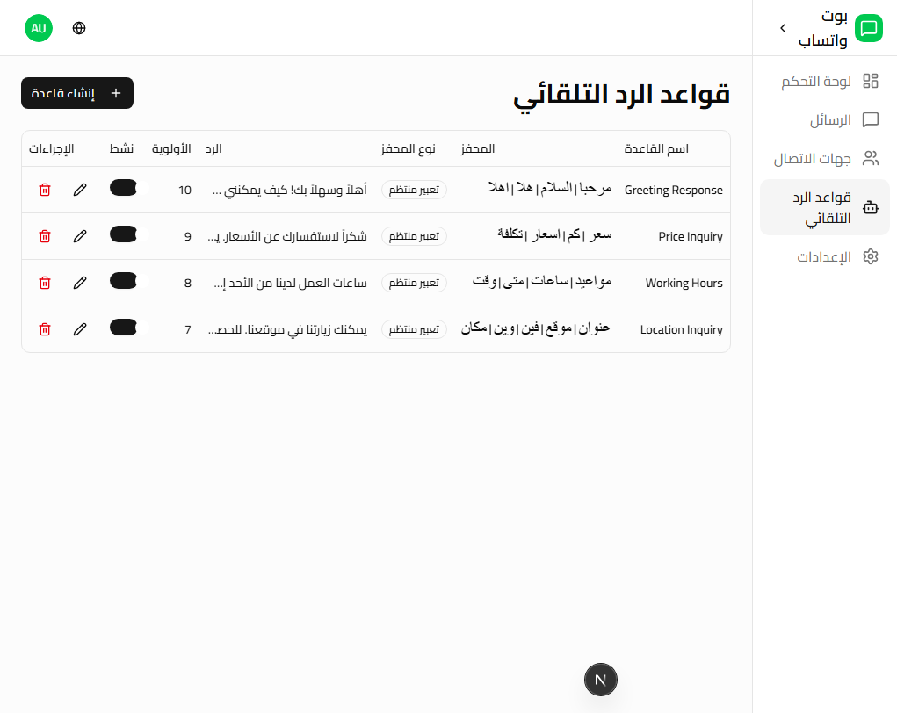</td>
</tr>
</table>
</div>

---

## Tech Stack

| Category | Technology |
|----------|------------|
| **Framework** | Next.js 16 (App Router, Turbopack) |
| **Language** | TypeScript 5 |
| **Database** | PostgreSQL 15 with Prisma ORM |
| **WhatsApp** | @whiskeysockets/baileys |
| **Auth** | NextAuth v5 (Credentials) |
| **i18n** | next-intl (Arabic RTL + English) |
| **UI** | Tailwind CSS v4, shadcn/ui, Radix UI |
| **Testing** | Vitest (Unit), Playwright (E2E) |
| **Deployment** | Docker, GitHub Actions CI/CD |

---

## Installation

### Prerequisites
- Node.js 20+
- PostgreSQL 15+
- Docker (optional)

### Quick Start

```bash
# Clone the repository
git clone https://github.com/mahmoodhamdi/whatsapp-sheets-bot.git
cd whatsapp-sheets-bot

# Install dependencies
npm install

# Configure environment
cp .env.example .env
# Edit .env with your configuration

# Setup database
npm run db:push
npm run db:seed

# Start development server
npm run dev
```

### Docker Setup

```bash
# Build and run with Docker Compose
docker-compose up -d

# View logs
docker-compose logs -f

# Stop
docker-compose down
```

---

## Configuration

### Environment Variables

| Variable | Description | Required |
|----------|-------------|:--------:|
| `DATABASE_URL` | PostgreSQL connection string | ✅ |
| `NEXTAUTH_SECRET` | NextAuth secret key | ✅ |
| `NEXTAUTH_URL` | Application URL | ✅ |
| `WHATSAPP_SESSION_PATH` | WhatsApp session storage path | ❌ |
| `GOOGLE_SHEETS_CREDENTIALS` | Base64 encoded service account JSON | ❌ |
| `GOOGLE_SHEET_ID` | Target spreadsheet ID | ❌ |
| `ADMIN_EMAIL` | Initial admin email | ❌ |
| `ADMIN_PASSWORD` | Initial admin password | ❌ |

### Default Credentials

After running `npm run db:seed`:
- **Email**: `admin@example.com`
- **Password**: `admin123` (or `ADMIN_PASSWORD` from .env)

---

## API Reference

### Authentication
| Method | Endpoint | Description |
|--------|----------|-------------|
| POST | `/api/auth/[...nextauth]` | NextAuth handlers |

### Contacts
| Method | Endpoint | Description |
|--------|----------|-------------|
| GET | `/api/contacts` | List contacts (paginated) |
| GET | `/api/contacts/[id]` | Get contact details |
| DELETE | `/api/contacts/[id]` | Delete contact |

### Messages
| Method | Endpoint | Description |
|--------|----------|-------------|
| GET | `/api/messages` | List messages |
| POST | `/api/messages/send` | Send a message |

### Rules
| Method | Endpoint | Description |
|--------|----------|-------------|
| GET | `/api/rules` | List all rules |
| POST | `/api/rules` | Create new rule |
| PUT | `/api/rules/[id]` | Update rule |
| DELETE | `/api/rules/[id]` | Delete rule |
| PATCH | `/api/rules/[id]/toggle` | Toggle rule status |

### WhatsApp
| Method | Endpoint | Description |
|--------|----------|-------------|
| GET | `/api/whatsapp/status` | Get connection status |
| POST | `/api/whatsapp/connect` | Initialize connection |
| POST | `/api/whatsapp/disconnect` | Disconnect |

### Google Sheets
| Method | Endpoint | Description |
|--------|----------|-------------|
| GET | `/api/sheets/status` | Get sync status |
| POST | `/api/sheets/sync` | Trigger manual sync |
| GET | `/api/sheets/logs` | Get sync logs |

---

## Project Structure

```
src/
├── app/
│   ├── (auth)/              # Authentication pages
│   │   └── login/           # Login page
│   ├── (dashboard)/         # Dashboard pages
│   │   └── dashboard/
│   │       ├── contacts/    # Contacts management
│   │       ├── messages/    # Message history
│   │       ├── rules/       # Auto-reply rules
│   │       └── settings/    # App settings
│   └── api/                 # API routes
├── components/
│   ├── dashboard/           # Dashboard components
│   ├── rules/               # Rule form components
│   └── ui/                  # shadcn/ui components
├── lib/
│   ├── google-sheets/       # Google Sheets integration
│   ├── whatsapp/            # WhatsApp client (Baileys)
│   ├── auth.ts              # NextAuth configuration
│   └── prisma.ts            # Prisma client
├── i18n/                    # Internationalization
│   └── messages/            # Translation files (ar, en)
└── types/                   # TypeScript types
```

---

## Testing

```bash
# Run unit tests
npm run test

# Run unit tests with watch mode
npm run test:watch

# Run E2E tests
npm run test:e2e

# Run E2E tests with UI
npm run test:e2e:ui

# Run all validations
./scripts/validate.sh
```

---

## Available Scripts

| Command | Description |
|---------|-------------|
| `npm run dev` | Start development server |
| `npm run build` | Build for production |
| `npm run start` | Start production server |
| `npm run lint` | Run ESLint |
| `npm run test` | Run unit tests |
| `npm run test:e2e` | Run E2E tests |
| `npm run db:push` | Push Prisma schema |
| `npm run db:seed` | Seed database |
| `npm run db:studio` | Open Prisma Studio |

---

## Google Sheets Setup

1. Create a Google Cloud project
2. Enable Google Sheets API
3. Create a service account and download JSON key
4. Base64 encode the JSON:
   ```bash
   cat service-account.json | base64
   ```
5. Set `GOOGLE_SHEETS_CREDENTIALS` environment variable
6. Set `GOOGLE_SHEET_ID` with your spreadsheet ID
7. Share the spreadsheet with the service account email

---

## Contributing

1. Fork the repository
2. Create your feature branch (`git checkout -b feature/amazing-feature`)
3. Commit your changes (`git commit -m 'Add amazing feature'`)
4. Push to the branch (`git push origin feature/amazing-feature`)
5. Open a Pull Request

---

## License

This project is licensed under the MIT License - see the [LICENSE](LICENSE) file for details.

---

<div align="center">

**Built with** ❤️ **using Next.js 16**

[Report Bug](https://github.com/mahmoodhamdi/whatsapp-sheets-bot/issues) • [Request Feature](https://github.com/mahmoodhamdi/whatsapp-sheets-bot/issues)

</div>
